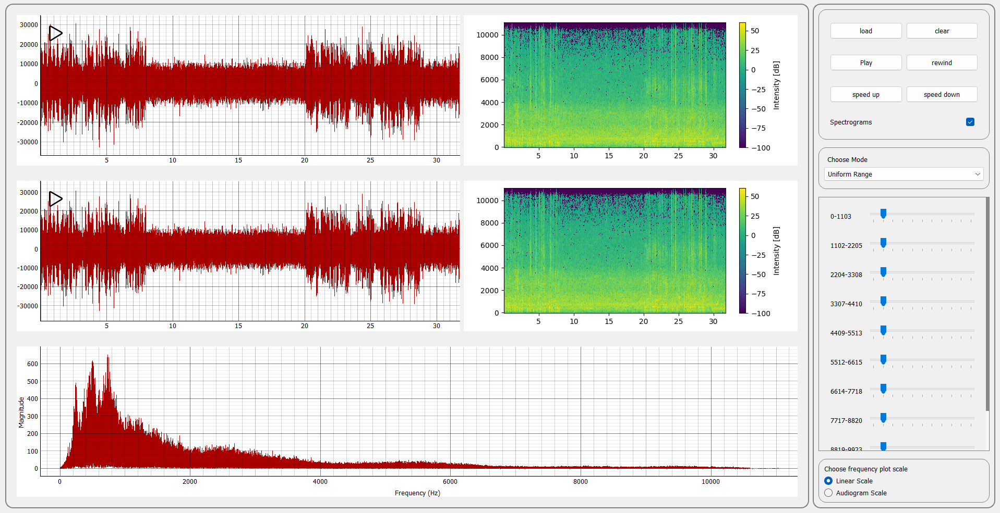

# Signal-Equalizer
A desktop signal processing app for adjusting frequency magnitudes across different modes (Uniform Range, Music & Vowels Mix, Music & Animals Mix, Wiener Filter). Features include real-time Fourier visualization, synchronized signal viewers with playback controls, dynamic spectrograms, signal equalization with sliders, noise removal based on silent segments, and the ability to reconstruct signals after modifications.

<div align="center">
  
</div>

## Table of Contents
- [Prerequisites](#prerequisites)
- [Installation](#installation)
- [Features](#features)
- [Contributors](#contributors)

## Prerequisites

- Python 3.6 or higher

## Installation

1. **Clone the repository:**

   ``````
   git clone https://github.com/AhmedAmgadElsharkawy/Signal-Equalizer.git
   ``````

2. **Install The Dependincies:**
    ``````
    pip install -r requirements.txt
    ``````

3. **Run The App:**

    ``````
    python main.py
    ``````

## Features

- **Signal Equalization Functionality**: Open a signal and adjust the magnitude of its frequency components using sliders. The user can reconstruct the signal after making modifications.

- **Uniform Range Mode**: Divide the frequency range into 10 equal ranges, each controlled by a slider. Validate using a synthetic signal composed of pure single frequencies.

- **Music & Vowels Mix Mode**: Control the magnitude of specific musical instruments or specific vowel from these vowels in a mixture using dedicated sliders.

- **Music & Animals Mix Mode**: Adjust the magnitude of individual animal sounds or specific specific musical instruments in a mixture via sliders.

- **Wiener Mode**: Remove noise from the signal based on a selected silent segment, ensuring a cleaner output.

- **Linked Cine Signal Viewers**: View input and output signals synchronously with features like play, pause, stop, speed control, zoom, pan, and reset.

- **Spectrograms**: Display spectrograms for both input and output signals, dynamically updating the output spectrogram as sliders are adjusted. Includes an option to toggle visibility.


## Contributors
- **AhmedAmgadElsharkawy**: [GitHub Profile](https://github.com/AhmedAmgadElsharkawy)
- **AbdullahMahmoudHanafy**: [GitHub Profile](https://github.com/AbdullahMahmoudHanafy)
- **MohamadAhmedAli**: [GitHub Profile](https://github.com/MohamadAhmedAli)
- **RawanAhmed444**: [GitHub Profile](https://github.com/RawanAhmed444)

